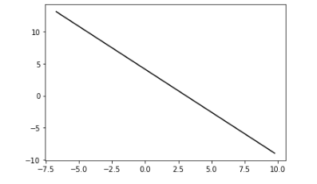

# ML_fundamentals

## 01.exercise-python-numpy-basics.ipynb
A number of quizes to get familiar with the Numpy library.

## 02.notebooks_math_linear-algebra_exercise-matrix-vector-operations.ipynb
Implementation of basic matrix operations, such as addition and multiplication without the standard methods included in the Numpy library.

## 03.notebooks_machine-learning-fundamentals_exercise-simple-linear-regression.ipynb
Implementation of `Linear Regression` with `Gradient Descent Algorithm`. Methods implemented in this module calculate the **Cost** of a linear function and apply the `Gradient Descent Algorithm` in order to find the line that best describes a Data Set, which can be expressed through a linear function.

## 04.multivariate-linear-regression.ipynb
Implementation of `Multivariate Regression` with `Gradient Descent Algorithm`. The methods that are implemented in this module allow linear regression to be applied on datasets that contain more than one feature. To achieve this `feature scaling` is applied on the data set.

With the aid of the Gradient Descent Algorithm, one can input initial `theta` values on the data set and iterate a number of times in order to get theta values that would help find a line that can fit **better** on the data set.

## 05.logistic-regression.ipynb
Implementation of `Logistic Regression`.

The purpose of logistic regression is to help classify the values of the data set in a specific class for instance `black` or `white`. The methods implemented in this module, achieve this by using the `sigmoid function` as the base of the cost function.

In order to train our model `Gradient Descent Algorithm` is applied on the data set. After taking as input initial `theta` values, which are chosen for our data set, the gradient descent algorithm calculates the partial derivatives of the cost function including the linear hypothesis. The gradients scaled by a scalar are subtracted from the given theta values.

After gradient descent is applied on the dataset and better `thetas` have been generated, the `decision boundary` and the `accuracy` of the model can be calculated with the aid of the following methods implemented on the module:

` plot_decision_boundary(thetas, data_set)`

`print_accuracy(thetas, data_set)`
